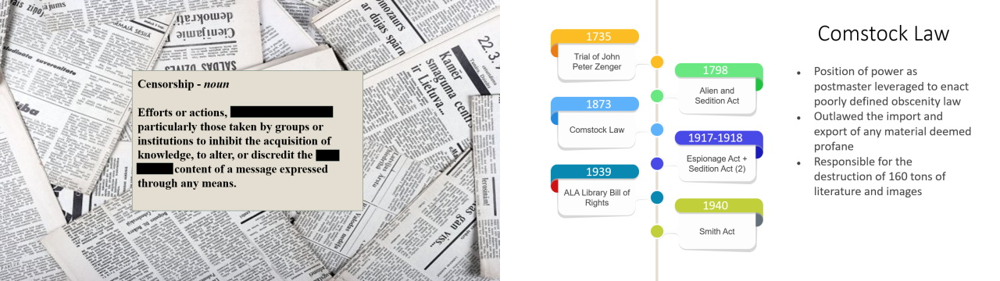

<h2>Course Synopsis</h2>

True to its name, this course provided a broad foundational overview of the interconnected policies of information science, the evolution of the library and its values over time, as well as some of the prescient issues influencing both contemporary and forecasted trends for information professionals.  While heavily expanded upon by personal and professional examples from the professor and class cohort, the content followed much the same format as its primary text *Foundations of Library and Information Science* by Richard E. Rubin (ISBN 978-0838913703).  Discussion of information systems and institutions naturally segued into the history of those complexes as experienced by the Western world.  With some historical context in hand, the course then focused on the values, ethics, policies, and best practices suggested by the American Library Association and the International Federation of Library Associations and Institutions.  Particular emphasis was given to the issues of technology bringing change to library and information systems, access considerations, informational freedom, and information science as a customer/human directed service industry.

**UNCG Student Learning Outcomes**
<ul>
<li>Analyze the concepts of ethics in relationship to information organizations (PLO’s 1,2,5,6)</li>
<li>Evaluate the policies and trends, including legal issues, of information organizations (1,2,3,5,6)</li>
<li>Analyze types of information organizations, professional jobs, and specializations (3,6,7)</li>  
<li>Examine the impact of multicultural and diverse populations on the profession (1,2,5)</li>  
<li>Analyze and apply basic research methods in LIS (2,3,4)</li>  
<ul>

----

<h2>Coursework Samples</h2>

Throughout the course we as students were asked to explore these broad topics in more contemporary and defined explorations through assignment.  Early papers specifically addressed real world issues by requiring us to seek out and elaborate on modern examples that have gained mainstream media attention, while later assignments asked for in-depth analysis of professional values or called upon us to identify industry trends through analysis of the topics and writing of self-selected journals over full runs of several decades.  As an extension of our exposure to the ethical guidelines and value considerations of the ALA and IFLA, students were required to become acquainted with and the research and human interaction ethics of CITI and obtain the corresponding certification.

</img>

Small groups led interactive discussion and lectures for the class on areas of focus for the profession that were either too large in scope or too important in concept to leave to a single author or voice.  The all-encompassing topic I chose to delve deeper into and educate myself on to the point that I felt I could competently lead discussion and presentation for one evening, was Intellectual Freedom.  Another student and I broke down the most salient points of the topic as covered in our text and identified areas that outside information or context would be most beneficial to include as we framed the presentation.  For my part, aspects of topical definitions, library policies, and history were to be my areas of expertise.

</img>

Coursework culminated in a research proposal with which students were to identify a problem experienced by libraries today, and highlight possible solutions or stopgaps through qualitative and quantitative evidence (should the research be carried out).  The issues of equal access to information and the digital divide both spark my interest and drive me to conceptualize actionable steps to bring populations in need closer to the resources best suited to meet those needs.  The Social Worker in me can't step away from SMART goal setting and offering relevant referrals with a strong consideration for the continuum of care in a community.  The research I proposed in this final assignment was a pilot program to test the merits of outreach/community libraries at bus stops and subway stations, bringing resources out of the library or digital domain to place them directly in the path of predominantly minority populations who rely on the public transit system and wouldn't be burdened by having to find the time or transportation for an additional trip to the library outside their daily routine in order to access materials.  A bus stop library might look a little something like the picture below.

----

<h2>Reflection & Takeaway</h2>

